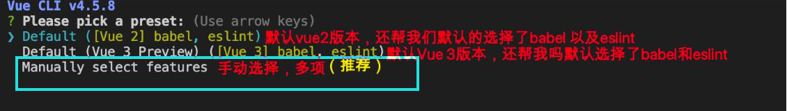
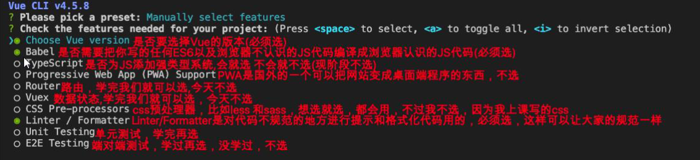
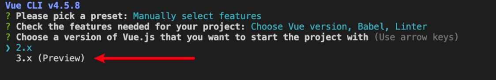
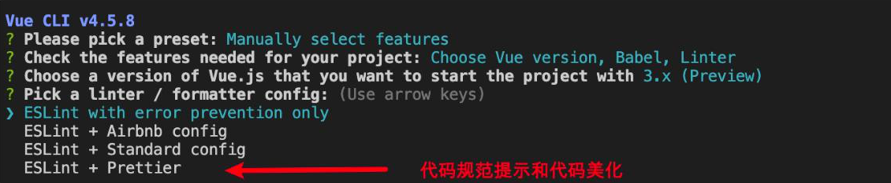
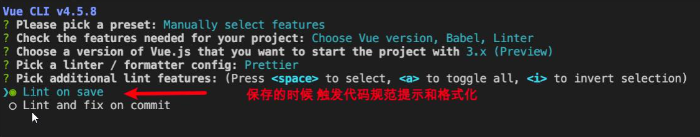
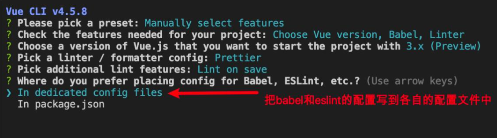

# 复习vue第一天

## 创建项目
```bash
vue create 项目名称
```
### 选择默认项



### 选择配置项



### 选择版本



### 选择代码规范模式



### 选择什么时候用于触发代码规范提示和美化



### 选择label和eslint的配置文件方式



### 启动服务
```shell
cd vuesyntax
npm run serve
```

## todolist
`app.vue`
```vue
<template>
  <div>
    <ToDoList></ToDoList>
  </div>
</template>

<script>
// todolist
import ToDoList from "./components/ToduList.vue"
export default {
  name: "App",
  components: {
    ToDoList,
  },
};
</script>

<style>
</style>
```

`todolist.vue`
```vue
<template>
  <div class="todolist">
    <ul>
      <li v-for="item in todolist" :key="item.id">
        <span>{{ item.todo }}</span>
        <input
          type="checkbox"
          :checked="item.done"
          @click="handleChange(item.id)"
        />
        <a href="#" @click="handleDel(item.id,$event)">删除</a>
      </li>
    </ul>
    <input type="text" placeholder="请输入要添加的事情" v-model="addMatter" />
    <button @click="handleAdd">增加数据</button>
  </div>
</template>

<script>
export default {
  name: "todolist",
  data() {
    return {
      addMatter: "",
      todolist: [
        { id: 1, todo: "打飞机", done: false },
        { id: 2, todo: "睡觉", done: false },
        { id: 3, todo: "打豆豆", done: false },
      ],
    };
  },
  methods: {
    // 修改状态
    handleChange(id) {
      const index = this.todolist.findIndex((item) => item.id === id);
      this.todolist[index].done = !this.todolist[index].done;
    },
    // 增加数据
    handleAdd() {
      this.todolist.push(
        {id: Date.now(), todo: this.addMatter,done: false}
      )
    },
    // 删除数据
    handleDel(id,e) {
      e.preventDefault();
      const index = this.todolist.findIndex(item => item.id === id)
      this.todolist.splice(index,1)
    }
  },
};
</script>

<style>
</style>
```

## vue3+comsitionAPI
### 路由
`app.vue`
```vue
<template>
  <div>
    <router-link to="/">Tab</router-link><br />
    <router-link to="/student">student</router-link>
    <router-view></router-view>
  </div>
</template>

<script>
// import HelloWorld from "./components/Tab.vue";

export default {
  name: "App",
  components: {
    // HelloWorld,
  },
};
</script>

<style>
#app {
  width: 100%;
}
* {
  padding: 0;
  margin: 0;
}
</style>

```
`routes/index.js`
```js
import { createRouter, createWebHashHistory } from "vue-router";
import Tab from "../components/Tab.vue";
import Student from "../components/Student.vue";

const routes = [
  { path: "/", component: Tab },
  { path: "/student", component: Student }
]

const router = createRouter({
  history: createWebHashHistory(),
  routes
})

export default router;
```
`main.js`
```js
import { createApp } from "vue";
import App from "./App.vue";
import router from "./routes";

createApp(App).use(router).mount("#app");
```
### Tab切换
```vue
<template>
  <div class="wrap">
    <div class="nav_left" id="navLeft">
      <div class="nav_content">
        <span
          v-for="(item, index) in warpList"
          :class="index === current ? 'active' : ''"
          :key="item.first_id"
          @mouseenter="handleEnter(item.first_id)"
          >{{ item.first_name }}</span
        >
      </div>
    </div>
    <div class="down">
      <i class="iconfont icon-xiajiantoubeifen gray"></i>
    </div>
  </div>
</template>

<script>
import { ref } from "vue";
export default {
  setup() {
    const current = ref(0);
    const warpList = ref([
      { first_id: "0", first_name: "热门" },
      { first_id: "621", first_name: "\u5496\u5561" },
      { first_id: "627", first_name: "\u996e\u98df" },
      { first_id: "279", first_name: "\u7537\u88c5" },
      { first_id: "294", first_name: "\u5973\u88c5" },
      { first_id: "122", first_name: "\u773c\u955c" },
      { first_id: "339", first_name: "\u5185\u8863\u914d\u9970" },
      { first_id: "391", first_name: "\u6bcd\u5a74" },
      { first_id: "35", first_name: "\u978b\u9774" },
      { first_id: "39", first_name: "\u8fd0\u52a8" },
      { first_id: "153", first_name: "\u7bb1\u5305" },
      { first_id: "119", first_name: "\u7f8e\u5986\u4e2a\u62a4" },
      { first_id: "355", first_name: "\u5bb6\u7eba" },
      { first_id: "51", first_name: "\u9910\u53a8" },
      { first_id: "334", first_name: "\u7535\u5668" },
      { first_id: "369", first_name: "\u5bb6\u88c5" },
      { first_id: "10", first_name: "\u5bb6\u5177" },
      { first_id: "223", first_name: "\u6570\u7801" },
      { first_id: "429", first_name: "\u6c7d\u914d" },
      { first_id: "546", first_name: "\u5065\u5eb7\u4fdd\u5065" },
      { first_id: "433", first_name: "\u5b9a\u5236" },
    ]);

    //#region  鼠标进入选中名字
    function handleEnter(id) {
      current.value = warpList.value.findIndex((item) => item.first_id === id);
    }
    //#endregion

    return {
      current,
      warpList,
      handleEnter,
    };
  },
};
</script>

<style scoped>
.wrap {
  width: 100%;
  display: flex;
  margin: 0.2rem 0 0 0;
  position: relative;
}

/*左侧的导航样式*/
.nav_left {
  width: 21.1875rem;
  overflow: scroll;
}

.nav_left::-webkit-scrollbar {
  display: none;
}

.nav_content {
  white-space: nowrap;
  padding: 0 0.7rem;
}

.nav_content span {
  display: inline-block;
  padding: 0.4rem 0.6rem;
  font-size: 0.875rem;
}

.nav_content .active {
  border-bottom: 2px solid #7f4395;
  color: #7f4395;
}

.nav_left,
.down {
  float: left;
}

/*右侧导航部分*/
.down {
  flex: 1;
  display: flex;
  align-items: center;
  justify-content: center;
}

.gray {
  color: gray;
  display: inline-block;
  vertical-align: middle;
}
</style>
```

### 学生管理系统
```vue
<template>
  <div>
    <h2>学生管理系统</h2>
    <div>
      <span>姓名:</span>
      <input type="text" v-model="nameValue" />
    </div>
    <div>
      <span>年龄:</span>
      <input type="number" v-model="ageValue" />
    </div>
    <div>
      <span>性别:</span>
      <select v-model="sexValue">
        <option value="男">男</option>
        <option value="女">女</option>
      </select>
    </div>
    <div>
      <button @click="handleAddOrChange">添加/修改</button>
    </div>
    <div>
      <table border="1" cellpadding="10" cellspacing="0">
        <tr>
          <th>序号</th>
          <th>姓名</th>
          <th>年龄</th>
          <th>性别</th>
          <th>操作</th>
        </tr>
        <tr v-for="item in studentList" :key="item.id">
          <td>{{ item.id }}</td>
          <td>{{ item.name }}</td>
          <td>{{ item.age }}</td>
          <td>{{ item.sex }}</td>
          <td>
            <button @click="handleDel(item.id)">删除</button>
            <button @click="handleExit(item.id)">编辑</button>
          </td>
        </tr>
      </table>
    </div>
  </div>
</template>

<script>
import { reactive, ref } from "vue";
export default {
  setup() {
    const studentList = reactive([
      { id: 1, name: "看看", age: 19, sex: "男" },
      { id: 2, name: "康康", age: 19, sex: "男" },
    ]);
    
    //#region  清空输入框
    function clearInput() {
      nameValue.value = "";
      ageValue.value = "";
      sexValue.value = "";
    }
    //#endregion
    
    //#region  增加内容
    const nameValue = ref("");
    const ageValue = ref("");
    const sexValue = ref("");
    function handleAddOrChange() {
      if (!isExit.value) {
        const newStudent = {
          id: studentList.length + 1,
          name: nameValue.value,
          age: ageValue.value,
          sex: sexValue.value,
        };
        studentList.push(newStudent);
        clearInput()
      }else {
        studentList[exitIndex.value].name = nameValue.value
        studentList[exitIndex.value].age = ageValue.value
        studentList[exitIndex.value].sex  = sexValue.value
        exitIndex.value = null
        clearInput()
      }
    }
    //#endregion

    //#region  删除
    const handleDel = (id) => {
      const index = studentList.findIndex((item) => item.id === id);
      studentList.splice(index, 1);
    };
    //#endregion

    //#region  修改
    const isExit = ref(false);
    const exitIndex = ref(null)
    const handleExit = (id) => {
      const index = studentList.findIndex((item) => item.id === id);
      exitIndex.value = index
      nameValue.value = studentList[index].name;
      ageValue.value = studentList[index].age;
      sexValue.value = studentList[index].sex;
      isExit.value = !isExit.value;
    };
    //#endregion

    return {
      studentList,
      nameValue,
      ageValue,
      sexValue,
      handleAddOrChange,
      // 删除
      handleDel,
      // 修改
      handleExit,
      // 清空输入框
      clearInput
    };
  },
};
</script>

<style></style>
```
